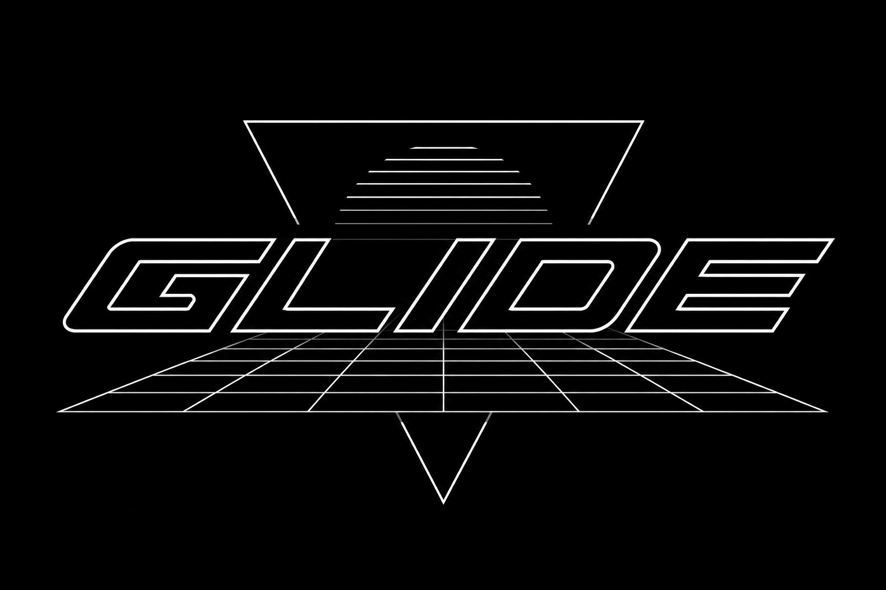

<p align="center">
  
</p>

# GLIDE

**A pocket synth that slides between every note, and builds its own sounds.**
Firmware for the M5Stack Cardputer, original (v1.1) and ADV. By **[CHARL3X](https://github.com/CHARL3X)**.

### ▶️ See it in action

<p align="center">
  <a href="https://www.youtube.com/shorts/tIkbVL5VmnQ">
    
  </a>
  <br><em>▶️ <a href="https://www.youtube.com/shorts/tIkbVL5VmnQ">Watch the demo</a></em>
</p>

Two things make GLIDE what it is.

You play it like a fretless string instrument. The key rows are tuned like strings and notes glide between pitches instead of snapping, so you can slide whole chords around and bend into notes right on the keyboard.

And the sounds are yours. You roll them, evolve them, and keep the ones that hit. The engine seeds two of your slots from a number only your device has, so out of the box no two Cardputers even start alike. Use it the way it wants to be used and no two players' racks ever sound the same.

That's the pitch. The rest of this is how it works.

> Lineage, for the curious: this is the second build of the instrument from the brainstorm, the "pitch touch bar" / "digital slide whistle," STRATA-1's little sibling. The touchscreen prototype proved sliding chords on a continuous-pitch surface is *absolutely sick*. This one answers a harder question: can that soul survive on 56 mechanical keys and a one-watt speaker? It can.

## The translation

The Cardputer's keyboard is a 4×14 matrix with staggered rows. Physically it's already a tiny fretboard, so GLIDE treats it like one:

- **Rows are strings.** Four of them, tuned a fourth apart (configurable), bottom row lowest. Columns step up the scale. It's an isomorphic grid, the same layout idea as the LinnStrument, the closest living relative of the instrument we sketched.
- **Continuous pitch lives in time, not space.** On glass you slid your finger. Here the *notes slide themselves*. Every legato transition portamentos: hold a chord shape, re-finger it three columns over, and every voice glides to its new target. That's the chord slide, the spark from the original conversation, intact.
- **Bend keys** (`[` and `]`) push the pitch up or down while held, like bending a string. Between glide and bend you can land anything between the twelve western notes. Microtonal, fretless, the whole point.

## The keymap

```
 string 3 (hi) |  1  2  3  4  5  6  7  8  9  0  |  - oct-   = oct+   bksp PANIC
 string 2      |  q  w  e  r  t  y  u  i  o  p  |  [ bend-  ] bend+  \  hold latch
 string 1      |  a  s  d  f  g  h  j  k  l  ;  |  ' scale lock      enter tilt
 string 0 (lo) |  z  x  c  v  b  n  m  ,  .  /  |  space sustain

 `     exit (HOLD ~0.7s)     fn (hold)    quick-edit layer
 tab   settings             shift (hold) momentary chromatic
 ctrl/opt volume -/+ (left thumb)        alt loop pedal (left thumb)
 - / =    octave -/+          G0 (top button) = trigger macro (muffle by default)
                                         (tap rec/play/dub, hold undo, fn+alt clear)

 fn + q..p         : switch between the ten sounds, live
 fn + shift + q..p : save your current tweaks over that slot
 fn + 1..0         : pick a parameter, [ ] to adjust
```

**How you play it:**

- Press keys. It sounds good immediately. Scale lock is on by default (A minor pentatonic, degree-mapped: every key is a scale tone, no dead keys, and sliding a shape sideways is a diatonic transposition). You can't really hit a wrong note. That's on purpose. It's the same thing that happens when you connect the pentatonic boxes across a guitar neck.
- **Hammer-on:** press a new key on the same row while holding one and the voice glides there. **Pull-off:** release it and the voice glides back. Each row behaves like a real string.
- **Slide a chord:** hold a shape across rows, then re-finger it elsewhere while the old notes still ring. Every voice glides. This is the thing.
- **Hold `shift` to break out of the scale.** Pure chromatic semitones, only while held. That's the skill gate. The scale keeps beginners safe; shift is how you earn the notes in between.
- **`fn` + top row** picks a parameter (glide, ADSR, wave, cutoff, voices, bend range, volume); `[` `]` adjust it live. Nothing is hardcoded. Every sound parameter has a control, and everything survives a reboot.
- The **oscilloscope** is live. That's the actual output waveform, with a phosphor afterglow. The note readout tracks the lead voice in cents *through* glides and bends, so you can see exactly where you are between the notes.
- Or flip the display to the **pitch trail** (settings → *Display*): the lead voice's pitch drawn over time, scrolling across ~7 seconds, with root-note gridlines as fret markers. On an instrument about the space *between* notes, this is the scope for the other axis. Every glide, hammer-on, and bend becomes a visible curve (bend-pulled segments draw amber), and with tilt-vibrato on you can watch the line shimmer.

## Your sounds are yours

This is the other half of GLIDE, and arguably the bigger one. The patches aren't a fixed factory list you pick from. They're a starting point you grow past.

Ten slots live on `fn`+`q`..`p`. Eight are a curated bank, led by **GLIDE** on `q` (the home/boot sound) and **ACID** on `w`. The last two, `o` and `p`, are **generative**: rolled from a seed unique to your unit, so they're different on every device on Earth. From there you build your own.

| key | sound | character | tilt does |
|-----|-------|-----------|-----------|
| q | **GLIDE** | the signature dry saw, and the literal boot tone | vibrato (roll: filter) |
| w | **ACID** | resonant squelch. lean into it, tilt is the wah | filter (full) |
| e | **Bass** | fat pulse bass: square sub for weight, driven, snappy filter pluck | filter (roll: vibrato) |
| r | **Solo** | bright square lead, always-gliding, 1/8-triplet delay in the pocket | vibrato |
| t | **Ethereal** | soft triangle pad, long glide, roomy hall. a bed to solo over | vibrato (roll: swell) |
| y | **Fat Square** | punchy square, bright per-note filter bloom, attack knock | filter |
| u | **Hollow** | driven square through a *notch* filter, phasey and hollow | volume swell (roll: filter) |
| i | **Drift** | lush always-gliding square, deep chorus and a 1/8 delay | filter |
| o | *generative* | rolled unique to your device, yours alone | (rolled) |
| p | *generative* | rolled unique to your device, yours alone | (rolled) |

A `*` in the `fn`+`q..p` list marks a slot holding *your own* sound. A `*` on the top status bar means the live sound has **unsaved edits** (shift-save to keep them). *Sound reset* restores one slot; *Reset all sounds* brings the whole bank back.

The bank is just the floor. The point is **rolling your own**:

- **Randomize.** A whole new patch in one tap. Oscillator, filter, envelopes, drive, FX, the LFOs, and a few mod-matrix routings, all painted inside musical bounds so a roll is always playable, never dead or blown out. Roll till you love one.
- **Mutate** (with **Mutate amt**). Don't start over, evolve what you have. A gentle mutate is a neighbour, same character nudged. A wild one rewrites it. Sculpting toward a vibe instead of pulling a slot machine.
- **Undo / Redo.** Every roll, mutate, and init checkpoints first, so you can always step back to the sound you just had. Experiment without ever trashing a keeper.
- **Init.** A blank, neutral sound to build up by hand.

Every action auditions on the spot with a short fixed lick, so you can A/B two rolls by ear. It all opens *first* in settings, as two big **Randomize** and **Mutate** buttons at the top of the **CREATE** section. (Settings is a collapsible accordion now, with only CREATE unfolded on open so the whole map fits at a glance.)

**Keeping what you find, two ways:**

- **Fast:** `fn`+`shift`+`q`..`p` saves the live sound onto one of the ten slots. Your quick-access favourites.
- **Unlimited:** **Save to SD** writes the sound to the microSD as a `.gpat` file, auto-named from the sound itself (`warm-haze-3f`, `frost-choir-1a`). **Load from SD** browses your whole library back. The card holds as many sounds as you'll ever roll, they're named so they read as *yours*, and because every file uses the same tagged format as the slots, the library survives firmware updates and travels card-to-card. (No card? The instrument still plays perfectly. SD only grows the library past ten.)

**Re-roll bank** resets the slots to the curated presets and rolls fresh randoms for `o` and `p` from a new seed. New sounds whenever you want them, presets intact. *Reset all sounds* is the way back without changing the seed.

> The seeded generator lives in `dsp/sound_gen`: pure, deterministic, and host-tested, same as the synth voice. See [docs/random-sound-generation.md](docs/random-sound-generation.md) for the design (and the note on the hardware-unverified SD pins).

Under the hood every sound rides five engine character-makers: a paraphonic **filter envelope** (retriggered by fresh attacks, never by legato hand-offs, so slides stay smooth), a **sub-oscillator**, env-gated **noise**, **drive** into the soft clipper, and built-in **vibrato**. All of it editable live and saved per slot.

## Tilt

The gyro debate, resolved as agreed, then promoted, because in practice it's fantastic. Tilt is an *assignable* effects modulator, toggled with `enter`, and **never pitch bend** (nobody wants to lean the instrument over again).

- **Per-sound personality.** Every patch ships with its own route and depth. ACID tilts into a full wah, Hollow into a volume swell, Ethereal and Solo into vibrato. Saving a slot saves its tilt setup too.
- **Depth** (settings): how hard the motion drives the effect, 0 to 100%.
- **Center calibration** (settings → *Tilt center*): "flat" becomes wherever *you* hold the thing, not wherever gravity says. Set it while holding the device in playing position.

## The layering jam (drones)

The brainstorm's "one hand plays the backing, the other solos over it," solved the way continuous-pitch instruments always have. Not a second chord interface, but **drones** (sitar, bagpipes, hurdy-gurdy lineage). Settings → *Jam rows*:

- The bottom one or two rows become **tap-to-latch drones**. Tap a key and it rings an octave down, hands-free, until you tap it again. Lay down a root, or root and fifth, and solo on the rows above.
- Drones are protected. They don't count against the lead's voice cap, and chord-slide stealing can never grab them. Your backing survives anything your solo hand does.
- The backing is *pitch-stable*: bend keys and tilt vibrato move only the solo layer. Your fretting hand bends strings; the open strings keep droning. (Drones do keep the patch's own built-in vibrato. That's part of the sound.)
- Release one and it fades with a long tail instead of stopping dead under your solo.
- The backing is visible. Latched drones show **amber** on the mini grid-map (held leads stay green) with a `+n` count, and jam motion blinks each struck key white on the beat so you can watch the arp walk. The `vox` counter shows leads against the cap only, since drones never count.
- Octave shifts sweep the drones along with everything else. Panic (bksp) clears them.

On by default (bottom row) with the **progression** motion ready, so out of the box you tap a chord loop on the bottom row and solo on the three above. Turn *Jam rows* off for a plain uniform grid.

## The loop pedal

The other half of "one hand backs, the other solos": **alt** (left thumb, since space already covers sustain) is a one-button looper. What it records is the *performance*, not the audio. The note events themselves, replayed through the live engine.

- **tap**: start recording. **tap again**: the loop closes and plays on that press. **tap again**: overdub a layer; once more seals it.
- **hold** (~0.6 s): peel the last overdub (undo). Hold again and it walks back up the stack; the gesture bounces at the ends, so repeated holds undo to the base take and redo to the top. The base loop is protected. You only ever peel the dubs you stacked on it. The annunciator shows the audible layer count (`x3`, or `x2/3` while peeled).
- **fn + alt**: clear the whole take in one deliberate chord.
- **panic** (bksp) silences the loop but keeps the take. Tap alt and it plays again.
- The hint line goes loop-aware while a take exists (`alt dub  hold undo  fn+alt clear`), so the gestures are always on screen.
- Because the loop is events, it costs kilobytes. The good part: it **plays through whatever sound is selected**. Record a Bass line, switch to Solo, solo over it. Swap sounds mid-jam and the whole arrangement re-voices itself. Recorded slides, hammer-ons, and octave sweeps replay as slides, hammer-ons, and sweeps.
- Loop playback is a protected backing layer like the drones. Its voices ride outside the voice cap, can't be robbed by chord-slide stealing, ignore live bends and tilt vibrato, never hijack the note readout, and survive sound switches and settings trips. Internally it plays on its own string lanes (4 to 7) with its own key ids, so it can never collide with your hands.
- Timing belongs to the audio thread. Playback events are *scheduled* (block-accurate, ~4 ms), not fired from the ~33 ms UI frame, so the loop doesn't swing with the frame rate.
- Status sits top-left of the scope: **REC** blinks red with elapsed time, **LOOP** green with a cycle-progress bar, **OVR** amber while layering, dim `LOOP --` for a stopped take. `FULL` means the take hit the 1024-event ceiling.

Loops are performance state. They live until cleared or power-off, and never hit flash.

## The chord progression (the easy way to back yourself)

The loop pedal records a *performance*, which means your timing has to be right, and a loop is one phrase, not a chord change. The drones fixed the timing problem (tap to latch, no rhythm) but a drone is one chord forever. The **auto-progression** is the missing middle: a soft chord progression you spell with no timing at all, then solo over. Settings → *Jam motion: progression* (needs *Jam rows* on):

- **Tap the chords in order on the jam row. That's it.** Each tap appends a step (repeats allowed: I-IV-V-IV is four taps). No metronome, no pocket to hit. The HUD confirms each one (`PROG  3: E`).
- The beat clock walks the steps **one chord per bar**, looping, at the *Jam tempo*. *Chord length* sets the beats per chord. The backing glides from chord to chord (of course it does) and re-blooms each bar, so on a pad or strings patch it's a soft wash you solo straight over.
- Each step is a **diatonic triad** built from the current scale: real major/minor/dim color, and always in key. The same "you can't hit a wrong note" guarantee the melody gets, now for the backing too. (Hold `shift`, or turn scale lock off, while tapping a step for a chromatic power-chord voicing instead.)
- It's a protected backing layer like the drones and the loop: cap-exempt, steal-proof, ignores your bends and tilt vibrato, and **re-voices through whatever sound you switch to** mid-jam. Lay down Ethereal, solo on Solo.
- The progression is on screen: a `PROG  A  D  E  ▸` strip across the top of the scope with the current chord boxed, and its root outlined on the grid-map so you can watch the changes walk.
- **bksp (panic)** clears the progression to start over, the same gesture that clears the drones. Like them, it's performance state and never hits flash.

Pick Ethereal, Drift, or Hollow for the bed, set a slow tempo, tap four chords, and you've got a song to solo on in about ten seconds.

## Soloing over the jam: a separate register and sound

Once the backing is looping, you don't want to be stuck in its octave or its sound. You want to *solo* over it. So the moment you change the solo while a jam runs, the backing holds its ground:

- **Different register.** Shift octave (or even change key/scale) and only your **solo** moves. The progression keeps looping in the register and key it was built in. Build a progression low, solo two octaves up over it.
- **Different sound.** Switch patches (`fn`+letter) over a running jam and the backing freezes onto the sound it was playing while the new patch becomes your solo voice. Lay down an Ethereal progression, flip to Solo, and wail over it. The pad keeps padding. An amber **`LK`** by the octave readout (and a `SOLO` flash on the switch) tells you the split is engaged.
- **Their own voice, a shared room.** The backing and the solo each keep their own oscillator, filter, envelope, and drive, but they wash into one shared reverb/delay space (the solo patch's), so the whole thing sits together instead of sounding like two unrelated machines.
- **`bksp` (panic)** clears the jam and drops the split. The next sound switch goes back to changing everything, as normal.

No new gesture to learn. Start the jam, then change your sound. The split appears when you need it and disappears when the jam's gone.

## Tempo, the synced delay, and the live FX rack

One tempo (the *Jam tempo*) drives both the progression and the echo. Two things make a solo over that backing sound produced:

- **Tap tempo** (settings → *Tap tempo*): tap `,` or `/` in time and the BPM follows your hand. Set the groove by feel, no number-nudging.
- **Tempo-synced delay** (settings → *Delay sync*): lock the echo to a musical division (`1/4`, `1/8.` the dotted eighth and the Edge/Gilmour trick, `1/8`, `1/8T`, or `1/16`) and every repeat lands on the beat. Solo and Drift ship with it on; switch to Solo over a progression and the repeats cascade right in the pocket. (Set it to `free` for a plain ms delay.) If a division is too long for the delay line at a slow tempo, it folds down an octave so it stays on the grid instead of clipping.

The whole **send-FX rack is live on-device** (settings): *Chorus*, *Delay send / time / sync / feedback*, *Reverb send / size*. Dial the space to taste and `fn`+`shift`+letter saves it with the slot, like every other sound parameter. The effects were the one thing you couldn't reach before. Now nothing about the sound is off-limits.

## The modulation matrix (get far from the default)

Tilt was the first assignable modulator. Now there's a whole rack of them, which is exactly how two players with the same device end up with sounds that share no DNA. Settings → *MOD SOURCES* and *MOD MATRIX*:

- **Two LFOs**, each with a shape (sine / tri / saw / square / **S&H** random) and either a free rate in Hz or a **tempo-sync** division locked to the *Jam tempo* (same `1/4` to `1/16` vocabulary as the delay), so a wobble or a filter sweep breathes in time with the progression.
- **A second envelope** (attack / decay) that retriggers on each note.
- **Six routing slots.** Each picks a *source* (LFO1, LFO2, mod-env, key-track, bend), a *destination* (pitch, cutoff, resonance, amp, filter-env depth), and a bipolar *amount*. Six slots across those sources and destinations is a huge sound-design space: vibrato, tremolo, auto-wah, growl, evolving pads, random steppers, all from a handful of primitives, all on the lead voice (the backing bed stays steady underneath). Everything defaults to off, so a fresh patch is the original GLIDE tone until you wire a slot.

**Filter modes** (settings → TONE → *Filter mode*): the filter does **lowpass** (the original voice), **highpass** (thin/airy), **bandpass** (vocal/telephone), and **notch** (hollow/phasey), free, because the filter already computes them all.

Every one of these saves with the slot (`fn`+`shift`+letter) and survives a reboot. And because patches use a **tagged format**, adding the next knob, or the one after that, will never wipe the sounds you've already saved. Expansion is the point. The further you get from the default, the more the instrument is *yours*.

## The philosophy, encoded

- **One device, your sound.** Everyone who buys a Cardputer holds the same 56 keys and the same one-watt speaker, so the engine was built deep enough that no two players' instruments need sound alike: a modulation matrix (two LFOs, a second envelope, tilt and per-note random as sources, routable to pitch, filter, amp, drive, and the FX), a multimode filter, and a full send-FX rack. It ships sounding good, a curated bank of hand-tuned voices ready to play, but it's built to *become yours*. That's the real product. Roll a new patch, mutate toward a vibe, undo back to the one you liked, keep it on a slot or in an unlimited SD library named in your own words. Two of your ten slots are generative from first boot, rolled from a seed only your device has, so no two units start alike, and you can roll fresh ones any time. Owning one was never meant to mean sounding like everyone else who owns one. Thanks to the tagged patch format, none of what you make is ever wiped by a future update.
- **The skill gap is the product.** Basic play takes minutes (scale lock plus degree mapping means the first session sounds good). Mastery takes honest practice: clean legato overlaps, accurate shape re-fingering, controlled bends into chromatic passing tones, two-row voice management under the 4-lane limit. The gap between what you hear in your head and what your fingers can do closes slowly, the way it's supposed to.
- **Nothing hardcoded.** 20+ parameters, all editable on-device (a quick-edit layer for the performance-critical ten, the settings screen for the rest), all persisted to NVS with debounced writes.
- **Failures are visible.** If the audio path can't start you get a red AUDIO INIT FAILED screen with the reason, never a silently dead instrument. Rejected changes (octave ceiling and the like) flash red in the HUD. A pocket instrument that dies mid-jam without warning is the same sin, so below 20% battery the perform screen says so (blinking red at 10%), and settings always shows the exact percentage.
- **Effects in service of the sound, not a rack to get lost in.** A per-voice lowpass with resonance, soft saturation, and a speaker-protecting highpass, plus one shared send block: chorus, a tempo-synced delay, and a small reverb. Every send is editable and saved per slot, but the tunings are curated and the defaults do the work. The identity is the sounds and how it plays, not knob-twiddling. (The Omnichord rule, with a delay that finally locks to the beat.)

## Quick start

**Via Launcher (recommended):** flash [bmorcelli's Launcher](https://github.com/bmorcelli/Launcher) once, copy `dist/GLIDE.bin` to `/apps/` on the microSD, boot → SD → GLIDE.

**Direct USB (overwrites Launcher):**
```
pio run -t upload
```
Entry procedure: power OFF, hold G0, plug USB-C, release G0.

No WiFi, no accounts, no setup. Power on, splash (the boot chime is a single note gliding up an octave, played through the synth itself), play.

**Persistence and reset:** everything you touch (sounds, tweaks, octave, scale, tilt setup, jam rows) saves to flash moments after you change it and survives reboots *and* firmware updates, since NVS lives outside the app partition. Three ways back:
- settings → *Sound reset*: current slot back to factory
- settings → *Reset defaults*: all settings back to factory (saved sounds kept)
- **press and hold backspace during the boot splash:** full factory reset, settings and saved sounds, even if stored state ever wedges the UI. Hold it through the red confirm bar (~1.5 s); release at any point cancels. Deliberate on purpose, since a stray tap used to wipe people's sessions. It has to be a press made *during* the splash and then sustained; the ADV's keyboard chip is event-driven and can't see a key held from power-on.

## Before you trust it: the Phase 0 probe

Two hardware assumptions need validating on *your* unit before the instrument's behavior can be trusted. The probe firmware tests both. Flash it the same way as the instrument (copy `dist/GLIDE-probe.bin` to `/apps/` on the SD for Launcher), or direct:

```
pio run -e phase0-probe -t upload
```

1. **Gapless audio.** Streams a 440 Hz sine through the same 3-buffer playRaw loop the instrument uses. The `STARVED` counter must stay 0 (green) for minutes. Press `space` to inject a deliberate 6 ms stall and prove the DMA headroom is real.
2. **Key rollover.** Mash chords; every key the keyboard controller reports lights green on the 4×14 grid, and `max seen` records your ceiling. The ADV's TCA8418 should do far better than the old matrix's ~3 keys. Whatever your ceiling is, set `voices` (fn+8) at or below it. Findings worth recording:

   | unit | starved (5 min) | max rollover | date |
   |------|-----------------|--------------|------|
   | _your Cardputer ADV_ | _?_ | _?_ | _?_ |

## Building

```
pio run                    # instrument -> dist/GLIDE.bin
pio run -e phase0-probe    # hardware probe
pio run -e native          # pure-DSP host tests (no hardware needed)
.pio/build/native/program  # run them
```

PlatformIO, `espressif32@6.12.0`, `m5stack/M5Cardputer@^1.1.1`. Serial monitor at 115200 (`pio device monitor`).

## Architecture (why it's split this way)

```
src/
├── dsp/        PURE C++ - no Arduino, no M5, no ESP-IDF. The instrument:
│               voices, glide engine, wavetables, filter, pitch math,
│               degree mapping. Compiles and tests on a PC (env:native).
├── io/         The hardware boundary: M5Unified playRaw streaming
│               (render task on core 0), positional keyboard reader,
│               IMU tilt. The ONLY code that knows it's on an ESP32.
├── ui/         Perform screen (scope/readout/grid-map/HUD), settings,
│               splash. Core 1, ~30 fps canvas.
└── storage/    NVS persistence, debounced.
```

The `dsp/` purity rule is the point. When this instrument grows into real hardware (a Daisy Seed brain, force-sensing strips, the deformable surface), the entire musical core moves over unchanged. The Cardputer is incarnation two. It won't be the last.

Audio path facts (verified against M5Unified source, not vibes): `playRaw` keeps a *pointer* (no copy) and queues 2 per channel, so GLIDE rotates 3 buffers and paces on `isPlaying()`. 32 kHz / 128-sample blocks gives a 4 ms cadence, ~12 ms output latency, under 25 ms key-to-ear. M5Unified owns the ES8311 codec's undocumented power-up sequence, which is why this firmware never touches raw I2S and why the library versions are pinned.

## Parameters

| param | range | default | where |
|---|---|---|---|
| glide time | 0-2000 ms | 120 | fn+1 |
| attack / decay / sustain / release | 0-2s / 0-2s / 0-100% / 0-3s | 5ms / 120ms / 70% / 250ms | fn+2..5 |
| waveform | sine, tri, saw, sqr, fat, pwm | saw | fn+6 |
| cutoff / resonance | 80-12k Hz / 0-95% | 4k / 30% | fn+7 / settings |
| voices | 1-8 | 6 | fn+8 |
| bend range / bend time | 1-12 st / 50-1000 ms | 2 st / 250 ms | fn+9 / settings |
| volume | 0-100% | 70% | ctrl/opt (left thumb) or fn+0 |
| root / scale / row interval | C-B / 13 scales / 1-12 st | A / min pent / 4th | settings |
| glide mode | legato-only / always | legato-only | settings (per sound) |
| allocation | strings (mono rows) / free poly | strings | settings |
| jam rows (drones) | off / bottom / bottom 2 | bottom | settings |
| jam motion | sustained / pulse / arp / progression | progression | settings |
| jam tempo / chord length | 40-240 bpm / 1-8 beats | 100 / 4 | settings |
| octave keys | sweep (glide) / re-strike | sweep | settings |
| trigger action / depth / mode | muffle, brighten, pitch dive, drive grit / 0-100% / momentary, latch | muffle / 70% / momentary | settings (G0 button) |
| sound slots | 10 (q=GLIDE, w=ACID, e..i curated, o/p generative per device) | curated + 2 rolled | fn+q..p, fn+shift+q..p |
| generate | randomize / mutate (+amount) / undo-redo / init / re-roll bank | live | settings (CREATE) |
| SD library | save / load / delete named .gpat patches (unlimited) | live | settings (LIBRARY), browser |
| filter env (atk/dec/depth) | 1ms-2s / 10ms-2s / 0-3+ oct | per sound | settings, saved in sound |
| sub / noise / drive / auto-vib | 0-1 / 0-1 / 1-8 / cents | per sound | saved in sound |
| chorus / delay / reverb send | 0-100% each | per sound | settings (live) |
| delay time / sync / feedback | 10-600ms / free+5 divisions / 0-90% | per sound | settings (live) |
| tap tempo | 40-240 bpm, tapped | live | settings |
| tilt routing | off / cutoff / vibrato / volume | per sound | settings, enter toggles |
| tilt depth | 0-100% | per sound | settings |
| tilt center | calibrated "flat" | 0 | settings (hold + set) |
| display | waveform scope / pitch trail | pitch trail | settings |
| solo/backing split | auto when you change sound/octave over a jam | live | live |

---

*"What fosters the most creativity? I think that's probably the way we should go."* That was the closing question from the brainstorm. This is the answer we keep testing against: an instrument cheap enough for anyone, easy enough to sound good tonight, deep enough to be worth twenty years.
